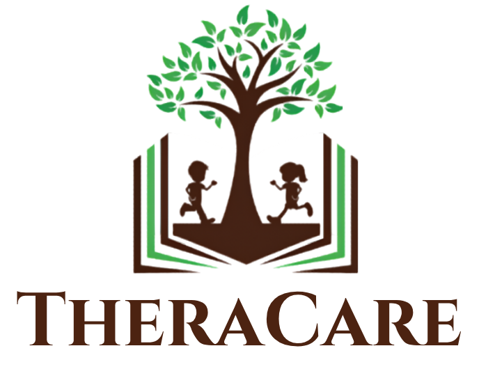

<div align="center">
  
  
  # TheraCare Clinic Management System
  
  **An Advanced, Scalable, and Unified Healthcare Monorepo**
  
  [](#)
  [](#)
  [](#)
  [](#)
  [](#)
  
  Built with ❤️ by **Evid Wijaya**
</div>

---

## 📖 Overview

**TheraCare** is a comprehensive, multi-portal clinic management system designed to streamline operations between administrators, therapists, and parents/patients. Built using a modern monorepo architecture, it guarantees seamless data sharing, consistent UI/UX, and rapid feature development across all interconnected applications.

This repository holds the entire ecosystem, including 30+ micro-frontends (Vite-based), a centralized API server, and shared utilities, allowing the entire clinic to run in perfect sync.

## ✨ Key Features

TheraCare is divided into three main operational pillars, each with dedicated applications and functionalities:

### 🛡️ Admin Portal (`apps/admin-*`)
* **Clinic Management**: Complete oversight of clinic operations, branding, and settings.
* **Scheduling & Rooms**: Advanced room allocation and bulk scheduling capabilities.
* **User Management**: Handle therapist registrations, attendances, and permissions.
* **Reporting**: Comprehensive data analytics and operational reports.

### 👩‍⚕️ Therapist Portal (`apps/therapist-*`)
* **Interactive Dashboard**: Quick access to daily schedules and tasks.
* **Child Progress**: Monitor and update patient milestones and therapy progress.
* **Availability Management**: Calendar synchronization for therapy sessions.
* **Performance Tracking**: Insights into completed sessions and performance metrics.

### 👨‍👩‍👧 Parent Portal (`apps/parent-*`)
* **Real-time Monitoring**: Track child progress and view therapy reports.
* **Meeting & Scheduling**: Request reschedules and join parent-therapist meetings.
* **Notification Center**: Receive instant updates regarding clinic announcements and session changes.

### 📱 Mobile Ready (Android WebView)
All web portals are fully responsive and wrapped into dedicated Android applications (Admin, Therapist, Parent) using WebView for native-like access on mobile devices.

---

## 🏗️ Architecture & Tech Stack

This project leverages a robust and modern technology stack designed for high availability and ease of maintenance:

* **Architecture**: Workspace-based Monorepo (NPM Workspaces)
* **Frontend Apps**: React / Vite Ecosystem
* **Backend Server**: Node.js API (`apps/server`)
* **Database**: PostgreSQL (Hosted on Railway)
* **ORM**: Drizzle ORM (`drizzle-kit`, `drizzle-orm`)
* **Deployment**: Vercel (Frontends) & Railway (Backend)
* **Mobile**: Flutter/Android WebView integration

### 📂 Directory Structure

```text
clinic-monorepo/
├── apps/                        # All independent applications and packages
│   ├── admin-app/               # Main Admin Dashboard
│   ├── parent-app/              # Main Parent Dashboard
│   ├── therapist-app/           # Main Therapist Dashboard
│   ├── server/                  # Centralized Backend API
│   ├── shared/                  # Shared UI components, types, and utilities
│   └── ... (25+ other specific modules)
├── .vscode/                     # Editor configurations
├── package.json                 # Root dependencies and workspace config
├── vercel.json                  # Deployment routing and rules
└── drizzle.config.ts            # Database schema and migration config
